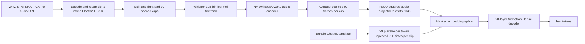

# Nemotron-Labs Audex-2B: vMLX to Osaurus integration specification

Date: 2026-07-20

Audience: vMLX reviewers, Osaurus/Dinoki runtime owners, chat/API owners, model
catalog owners, and release-proof reviewers.

Companion artifacts:

- [Runtime checkpoint](AUDEX-2B-RUNTIME-CHECKPOINT-2026-07-20.md)
- [Machine-readable wiring manifest](AUDEX-2B-OSAURUS-WIRING-MANIFEST.json)
- [Copy-paste PR comment](AUDEX-2B-PR-COMMENT-2026-07-20.md)
- [Native Swift implementation](../Libraries/MLXVLM/Models/Audex.swift)
- [Affine converter](../scripts/convert-audex-affine.py)
- [Official NVIDIA model](https://huggingface.co/nvidia/Nemotron-Labs-Audex-2B)
- [Official NVIDIA Space](https://huggingface.co/spaces/nvidia/Nemotron-Labs-Audex)

## 1. Executive contract

This PR adds native vMLX support for the audio-input portion of NVIDIA
Nemotron-Labs-Audex-2B. The source and 4-bit affine bundles load through the
normal vMLX VLM factory, consume text plus real audio, and produce text. The
implementation uses the bundle tokenizer, chat template, generation config,
NV-Whisper/Qwen2 audio encoder, audio projector, dense text decoder, and
standard vMLX KV-cache path.

The exact support boundary is:

| Capability | PR status | Osaurus exposure |
| --- | --- | --- |
| Text input -> text output | Supported and live-tested | Enable |
| Audio input -> text output | Supported and live-tested | Enable |
| Image input | Rejected by the model | Hide/reject |
| Video input | Rejected by the model | Hide/reject |
| Text-to-speech | Not implemented in Swift | Hide |
| Text-to-audio | Not implemented in Swift | Hide |
| Speech-to-speech audio output | Not implemented in Swift | Hide |
| Batch size greater than one | Rejected by the model | Do not schedule |

`Audex` conforms to `VLMModel` because it splices media embeddings into a text
decoder. That protocol identity does **not** mean it accepts images. Osaurus
must use `ModelMediaCapabilities.audioOnly`, not its generic `isVLM` image
fallback.

The branch is not an all-modality Audex completion. NVIDIA's output-audio
pipelines depend on additional causal speech decoder, XCodec/XCodec2,
text-to-audio CFG, and optional enhancement-VAE components. Those components
are downloaded locally, but this PR does not implement or claim them.

## 2. Source of truth and provenance

Use this precedence when facts disagree:

1. The pinned local NVIDIA bundle files.
2. The native Swift implementation and its focused tests.
3. The machine-readable manifest in this PR.
4. This human-readable integration specification.
5. The checkpoint/proof log.

Pinned inputs:

| Artifact | Revision | Local path |
| --- | --- | --- |
| NVIDIA model repo | `d43e996bab673833ffb56dcfcc5b658f229f7343` | `~/models/nvidia/Nemotron-Labs-Audex-2B` |
| Runtime checkpoint | same model revision | `~/models/nvidia/Nemotron-Labs-Audex-2B/checkpoint_folder_full` |
| NVIDIA Space | `c66674198bafcc086730538b1d0c86b759b133ee` | `~/models/nvidia/Nemotron-Labs-Audex-Space` |
| vMLX 4-bit affine bundle | generated locally | `~/models/nvidia/Nemotron-Labs-Audex-2B-4bit-vMLX` |

Download verification recorded 106 model payload files and
12,281,588,752 bytes. A Hugging Face dry-run reported no missing model files.
The Space snapshot is 531 MiB. The local case-insensitive filesystem cannot
hold both the repo's root `LICENSE` file and lowercase `license/` directory, so
the root file is stored as `LICENSE.txt`; the actual license directory and
third-party notices remain present.

## 3. Bundle identity and discovery

### 3.1 Required identity

The loader key is the exact lowercased `config.json` value:

```json
{
  "model_type": "nemotron_dense_audex",
  "architectures": ["NemotronDenseAudexForConditionalGeneration"]
}
```

vMLX dispatch:

- `VLMTypeRegistry["nemotron_dense_audex"]` creates `Audex`.
- `VLMProcessorTypeRegistry["Qwen2AudioProcessor"]` creates
  `AudexProcessor`.
- Processor configuration may come from
  `audio_preprocessor/preprocessor_config.json` when neither the root
  `preprocessor_config.json` nor `processor_config.json` exists.

Osaurus discovery must recognize both:

- Model IDs or local names containing `nemotron-labs-audex`.
- Underscore-normalized names containing `nemotron_labs_audex`.
- Installed bundles whose `config.json.model_type` is
  `nemotron_dense_audex`, even if the folder name is arbitrary.

The resolved Osaurus capability is exactly:

```swift
Capabilities(
    supportsImage: false,
    supportsVideo: false,
    supportsAudio: true
)
```

### 3.2 Do not route through vision detection

Do not add Audex to `VLMDetection` as an image family. That detector is used by
image-related UI and fallback behavior. The vMLX factory registry already owns
model loading; `ModelMediaCapabilities` owns attachment exposure.

The Osaurus integration patch also makes known media-family capabilities
authoritative before applying the generic `isVLM` image fallback. This prevents
the following incorrect widening:

```text
Audex loads through VLM factory
    -> picker item says isVLM
    -> generic fallback says image capable
    -> audio-only model incorrectly accepts image attachments
```

Audex must stay `audioOnly` through selection, drag/drop, request construction,
and runtime policy validation.

## 4. Architecture contract

### 4.1 Text decoder

| Field | Value |
| --- | ---: |
| Vocabulary | 205,312 |
| Hidden width | 2,048 |
| Intermediate width | 9,216 |
| Decoder layers | 28 |
| Query heads | 16 |
| KV heads | 8 |
| Head dimension | 128 |
| Attention | grouped-query causal attention |
| Position encoding | RoPE, theta 100,000,000 |
| Maximum positions | 131,072 |
| Norm | RMSNorm, epsilon `1e-5` |
| MLP | linear -> ReLU-squared -> linear |
| Tied embeddings | false |

Representative source tensor layouts:

| Tensor | Source shape | Swift destination |
| --- | --- | --- |
| `model.embed_tokens.weight` | `[205312, 2048]` | `Embedding` |
| `model.layers.0.self_attn.q_proj.weight` | `[2048, 2048]` | query linear |
| `model.layers.0.self_attn.k_proj.weight` | `[1024, 2048]` | grouped KV linear |
| `model.layers.0.mlp.up_proj.weight` | `[9216, 2048]` | ReLU-squared MLP up projection |
| `lm_head.weight` | `[205312, 2048]` | untied output head |

### 4.2 Audio encoder and projector

| Field | Value |
| --- | ---: |
| Encoder family | NV-Whisper/Qwen2 audio encoder |
| Mel bins | 128 |
| Encoder width | 1,280 |
| Encoder layers | 32 |
| Encoder heads | 20 |
| Encoder FFN width | 5,120 |
| Maximum source positions | 1,500 |
| Projector | RMSNorm -> 1280x4096 -> ReLU-squared -> 4096x2048 |

Representative source tensor layouts:

| Tensor | Source shape | Loader handling |
| --- | --- | --- |
| `audio_encoder.conv1.weight` | `[1280, 128, 3]` | transpose to MLX Conv1d layout |
| `audio_encoder.conv2.weight` | `[1280, 1280, 3]` | transpose to MLX Conv1d layout |
| `audio_encoder.embed_positions.weight` | `[1500, 1280]` | direct |
| `audio_encoder.layers.0.self_attn.q_proj.weight` | `[1280, 1280]` | direct |
| `audio_projector.fc1.weight` | `[4096, 1280]` | direct |
| `audio_projector.fc2.weight` | `[2048, 4096]` | direct |

The load sanitizer transposes only three-dimensional `audio_encoder.conv*`
weights. Other weights retain their checkpoint layout.

### 4.3 Runtime data flow



There is no output-audio branch after `Text tokens` in the native Swift graph.

## 5. Audio preprocessing contract

### 5.1 Accepted vMLX input types

`AudexProcessor` accepts the shared `UserInput.Audio` cases:

```swift
case url(URL)
case samples([Float], sampleRate: Int)
case array(MLXArray, sampleRate: Int)
case preEncoded(samples: [Float], sampleRate: Int, embedding: MLXArray)
```

The normal processor path decodes/resamples to mono 16 kHz PCM. The
`preEncoded` `UserInput` case is deliberately normalized from its PCM samples;
the processor does not assume an embedding produced by some other model is
compatible with Audex. The lower-level `LMInput.ProcessedAudio` path can carry
an Audex-compatible `preEncodedEmbedding` and make the model skip its own
mel/audio-encoder pass.

Osaurus's current live-voice preencoder is specialized for
`NemotronHOmni`. It must not cast or reuse a Nemotron Omni embedding as an
Audex embedding. Audex-specific cross-turn audio-embedding reuse is not part of
this PR.

### 5.2 File/container handling

Osaurus has two audio materialization paths:

1. Valid WAV payloads are decoded directly into `UserInput.Audio.samples`.
2. Other containers are materialized to a temporary file with the declared
   extension and passed as `UserInput.Audio.url`, where AVFoundation performs
   decoding and resampling.

The in-app picker/drop surface currently advertises `.audio`, MP3, WAV, and
MPEG-4 audio. vMLX's URL path may decode other AVFoundation-supported formats,
but the PR should claim only formats that receive an actual UI/API proof.

### 5.3 Exact Whisper frontend

Per clip:

| Stage | Contract |
| --- | --- |
| Sample rate | 16,000 Hz |
| Clip length | 480,000 samples / 30 seconds |
| Padding | right-pad final clip with zeroes |
| Centering | reflect-pad 200 samples on each side |
| Window | periodic Hann, length 400 |
| FFT | real FFT, `n=400`; no radix-2 zero-padding substitution |
| Hop | 160 samples |
| Spectrum | magnitude squared |
| Mel filters | 128 Slaney-scale, area-normalized filters |
| Numerical floor | `1e-10` before base-10 log |
| Frames | generate 3,001 STFT frames, drop the final frame |
| Dynamic range | clamp at `max(logMel) - 8` |
| Final normalization | `(logMel + 4) / 4` |
| Output shape | `[1, 128, 3000]` per clip |

The deterministic focused test compares shape, minimum, maximum, mean, and a
specific feature cell against output generated from NVIDIA's official
processor behavior.

### 5.4 Clip and placeholder expansion

Every 30-second clip produces 750 projected audio embeddings. The processor:

1. Adds one `<so_start><so_embedding><so_end>` wrapper to the latest user
   message before applying the bundle chat template.
2. Tokenizes normally so the wrapper preserves token IDs 30, 29, and 31.
3. Replaces the first token ID 29 with `750 * clipCount` copies of ID 29.
4. Passes a waveform tensor shaped `[clipCount, 480000]`.
5. Declares `mediaTokenIds = [29]` for cache boundary safety.

The model rejects the request if the placeholder count does not exactly match
the encoder/projector output row count.

Long audio is split into consecutive clips, but only short real-audio rows are
live-proven. Do not make a production maximum-duration claim until long-audio
context, memory, cancellation, cache, and output-quality rows exist.

## 6. Tokenizer and template contract

### 6.1 Important token IDs

| Token | ID | Use |
| --- | ---: | --- |
| `<unk>` | 0 | tokenizer unknown / bundle pad ID |
| `<s>` | 1 | BOS |
| `</s>` | 2 | EOS |
| `<|im_end|>` | 11 | ChatML EOS |
| `<think>` | 12 | reasoning start |
| `</think>` | 13 | reasoning end |
| `<so_embedding>` | 29 | audio embedding placeholder |
| `<so_start>` | 30 | audio span start |
| `<so_end>` | 31 | audio span end |

### 6.2 Large added-token vocabulary

The tokenizer contains 74,733 added tokens:

| Indexed family | Count | Token-ID range |
| --- | ---: | --- |
| `<SPECIAL_N>` | 970 | 18-999 |
| `<speechcodec_N>` | 65,536 | 131,077-196,612 |
| `<audiocodec_N>` | 8,192 | 196,613-204,804 |
| Other named added tokens | 35 | non-contiguous |

Compiling every indexed placeholder into one ICU alternation made tokenizer
preparation take roughly 39-40 seconds. The vendored tokenizer fix excludes
only syntactically indexed placeholder names from the regex while retaining
them in the token-ID maps. Named markers such as `<so_embedding>`, `<think>`,
and `<|im_end|>` still use normal special-token isolation.

Measured preparation after the fix is 44-48 ms on the live Audex rows.

Do not delete codec tokens from the tokenizer. They are required for future
output-audio decoding and bundle fidelity even though this PR does not decode
them to audio.

### 6.3 Thinking and instruct mode

The bundle ChatML template owns thinking behavior:

- Default: `enable_thinking` is true and the generation prompt opens
  `<think>`.
- Instruct: pass `enable_thinking: false`; the template emits the bundle's
  empty thinking segment.
- Prior assistant reasoning is represented through `reasoning_content` and the
  template's own history logic.
- `reasoning_budget` and tool-related context remain bundle/template inputs.

Osaurus may expose an explicit user control that populates the template
context. It must not add forced tags or rewrite output to simulate either mode.

## 7. Generation contract

The bundle `generation_config.json` provides:

```json
{
  "bos_token_id": 1,
  "eos_token_id": [2, 11],
  "pad_token_id": 0
}
```

Rules:

- Construct generation parameters from the active bundle configuration.
- Preserve both EOS IDs.
- Apply temperature/top-p/top-k/repetition settings only when explicitly
  supplied by the request or another established bundle contract.
- Greedy ASR is a valid explicit task request, not a family-wide hidden default.
- NVIDIA suggests task-specific sampling for audio QA. Treat that as a caller
  recipe, not an Osaurus correction layer.
- Do not mask audio-token ranges to make text output appear coherent.
- Do not force thinking openers/closers, prompt coercion, repetition penalties,
  or synthetic output caps.

The local smoke harness explicitly used temperature zero for transcription.
That proves greedy ASR behavior; it does not redefine the bundle defaults.

## 8. vMLX load and execution contract

### 8.1 Factory and processor registration

Required vMLX source changes:

| File | Responsibility |
| --- | --- |
| `Libraries/MLXVLM/Models/Audex.swift` | native architecture, processor, frontend, splice, typed errors |
| `Libraries/MLXVLM/VLMModelFactory.swift` | model/processor registration and nested audio preprocessor lookup |
| `Libraries/MLXLMCommon/ModelRuntimeCapabilitySnapshot.swift` | positive audio capability for `nemotron_dense_audex` |
| `Vendors/swift-transformers/Sources/Tokenizers/Tokenizer.swift` | indexed codec-placeholder regex scaling fix |
| `scripts/convert-audex-affine.py` | correctness-first affine quantization |

The existing Osaurus `ModelRuntime` force-links both VLM and LLM factories and
loads through `loadModelContainer`. No Audex-specific loader fork is required.

### 8.2 Typed rejection behavior

The model/processor intentionally fail with explicit errors for:

| Condition | Expected behavior |
| --- | --- |
| Image or video is supplied | reject: Audex accepts audio and text only |
| Token batch dimension is not one | reject with received shape |
| Lower-level PCM is not 16 kHz | reject with actual/required rate |
| Tokenizer loses `<so_embedding>` | reject with required token ID 29 |
| Placeholder count differs from projected embeddings | reject with both counts |

Osaurus should surface these errors. It should not retry after stripping media
or silently send a text-only request.

### 8.3 Prefill progress

The implementation reports completion of audio feature preparation and uses
`chunkedPrefillEmbedding` for the embedded text/audio prompt. The default
embedded prefill window is 512 tokens unless a caller supplies another window.

Osaurus should forward the existing vMLX prefill progress events. It must not
replace them with a UI timer estimate. Audio preprocessing and language prefill
are distinct stages and should remain distinguishable when the runtime exposes
that detail.

## 9. Quantization contract

The supplied converter creates a correctness-first MLX affine bundle:

```text
bits:       4
group size: 64
mode:       affine
```

Quantized:

- two-dimensional `model.*` text weights;
- `lm_head.weight`.

Kept at source precision:

- `audio_encoder.*`;
- `audio_projector.*`;
- normalization and non-matrix tensors.

The output index records:

```json
{
  "total_size": 2567320669,
  "source_model": "nvidia/Nemotron-Labs-Audex-2B",
  "audio_encoder_precision": "source",
  "audio_projector_precision": "source"
}
```

Conversion:

```bash
python3 scripts/convert-audex-affine.py \
  "$HOME/models/nvidia/Nemotron-Labs-Audex-2B/checkpoint_folder_full" \
  "$HOME/models/nvidia/Nemotron-Labs-Audex-2B-4bit-vMLX" \
  --bits 4 \
  --group-size 64
```

The Python environment must contain MLX. The converter refuses to overwrite a
non-empty destination. Do not quantize the audio encoder/projector in this PR;
that requires a separate accuracy and memory comparison.

## 10. Cache contract

### 10.1 Implemented topology

Audex uses one standard grouped-query KV cache per one of its 28 dense text
layers. It has no SSM, linear-attention, rotating-window, or architecture-
specific recurrent companion state.

The media cache salt is a SHA-256 over:

- audio tag;
- sample rate;
- normalized waveform shape;
- waveform dtype;
- normalized raw PCM bytes;
- semantic request scope such as thinking mode;
- selected KV-cache policy.

This means:

- the same normalized PCM plus the same prompt/scope can reuse a cache key;
- different audio cannot collide under an identical text placeholder stream;
- source container differences do not fragment cache identity after they decode
  to identical PCM;
- an optional pre-encoded embedding is not hashed, so the same logical audio
  remains the same request identity across encode paths;
- thinking mode and KV representation remain isolated.

### 10.2 Media boundary safety

Token ID 29 is declared as the media placeholder. If a partial cache hit leaves
any ID 29 in the remaining suffix, vMLX discards that hit and performs full
prefill. A boundary is eligible only after the complete placeholder run. This
prevents an embedding splice from being divided across restored and newly
encoded state.

### 10.3 Proven versus unproven

| Cache statement | Status |
| --- | --- |
| Standard 28-layer KV construction | Source-proven |
| Three-turn text behavior | Live-proven |
| Compiled and non-compiled decode coherence | Live-proven |
| Media waveform/scope/policy salt | Source-proven |
| Media-placeholder rollback rules | Source-proven |
| Audex audio prefix-cache hit counter | Not live-proven |
| Paged-cache hit counter | Not live-proven |
| L2 disk restore counter | Not live-proven |
| Audex-specific reusable audio embedding | Not implemented |
| Long-audio cache restore | Not live-proven |

Do not advertise prefix, paged, L2, or audio-embedding cache acceleration from
source presence alone. The Osaurus proof run must record the actual counters
and effective topology. Ordinary single-batch loading must not silently enable
paged RAM cache merely for the proof.

## 11. Osaurus/Dinoki wiring

### 11.1 Pin hygiene

The current Osaurus `main` worktree points to vMLX commit:

```text
f2b184841e98d969e46dec83109f27cd7bb57357
```

That commit predates Audex. After the vMLX PR has a pushed, reviewable commit,
replace the pin with that exact commit in all four consumer surfaces:

1. `Packages/OsaurusCore/Package.swift`
2. `Packages/OsaurusCore/Package.resolved`
3. `osaurus.xcworkspace/xcshareddata/swiftpm/Package.resolved`
4. `App/osaurus.xcodeproj/project.xcworkspace/xcshareddata/swiftpm/Package.resolved`

Do not pin an uncommitted worktree, a local path, or floating `main`. After the
update, verify all four files resolve to the same SHA from a clean checkout.

### 11.2 Osaurus source patch

The integration worktree changes:

| File | Required change |
| --- | --- |
| `ModelMediaCapabilities.swift` | add `.audioOnly`; recognize Audex name/model type; keep known media family authoritative over generic image fallback |
| `ChatView.swift` | do not let `isVLM` add image support to known audio-only families |
| `ModelMediaCapabilitiesMCDCTests.swift` | name, config, and composer-fallback coverage |
| `MultiTurnFamilyMatrixTests.swift` | installed bundle `model_type` coverage |
| `ModelPickerItemChatCapabilityTests.swift` | prove VLM factory identity does not advertise images |

### 11.3 Existing route reused by Audex

No Audex-only chat transport is needed. The existing path is:

```mermaid
flowchart LR
    A[Dinoki/Chat attachment] --> B[ModelMediaCapabilities.audioOnly]
    B --> C[ChatMessage input_audio part]
    C --> D[ModelRuntime.mapOpenAIChatToMLX]
    D --> E[UserInput.Audio samples or URL]
    E --> F[AudexProcessor]
    F --> G[Audex.prepare]
    G --> H[BatchEngine / TokenIterator]
    H --> I[Text, reasoning, tool, info stream]
```



The same `input_audio` route is used by the OpenAI-compatible API. Runtime
policy validation must run before inference and use installed-bundle facts when
available.

### 11.4 UI behavior

When Audex is selected:

- enable audio file picker entries;
- accept audio drag/drop;
- preserve live voice/sample payloads;
- disable image and video attachments;
- clear or visibly reject incompatible pending image/video attachments after a
  model switch;
- display text output only;
- do not show TTS/TTA/S2S output controls as Audex capabilities;
- show real runtime prefill progress during audio processing;
- display token/s from completion info;
- use the app process's physical footprint for RAM proof.

### 11.5 OpenAI-compatible request

Osaurus accepts `input_audio` with base64 bytes and an explicit format:

```json
{
  "model": "Nemotron-Labs-Audex-2B-4bit-vMLX",
  "messages": [
    {
      "role": "user",
      "content": [
        {
          "type": "input_audio",
          "input_audio": {
            "data": "BASE64_AUDIO_BYTES",
            "format": "wav"
          }
        },
        {
          "type": "text",
          "text": "Transcribe the speech exactly."
        }
      ]
    }
  ],
  "stream": false,
  "temperature": 0
}
```

Example shell request:

```bash
AUDEX_SERVER="http://127.0.0.1:1337"
AUDEX_MODEL="Nemotron-Labs-Audex-2B-4bit-vMLX"
AUDEX_AUDIO="/path/to/speech.wav"
AUDEX_AUDIO_B64="$(base64 < "$AUDEX_AUDIO" | tr -d '\n')"

curl --fail-with-body "$AUDEX_SERVER/v1/chat/completions" \
  -H 'Content-Type: application/json' \
  -d "$(jq -n \
    --arg model "$AUDEX_MODEL" \
    --arg audio "$AUDEX_AUDIO_B64" \
    '{
      model: $model,
      messages: [{
        role: "user",
        content: [
          {type: "input_audio", input_audio: {data: $audio, format: "wav"}},
          {type: "text", text: "Transcribe the speech exactly."}
        ]
      }],
      stream: false,
      temperature: 0
    }')"
```

The response is a normal text assistant completion. Do not request or promise
an audio response modality in this PR.

### 11.6 Direct Swift request

```swift
let messages: [Chat.Message] = [
    .user(
        "Transcribe the speech exactly.",
        audios: [.url(URL(fileURLWithPath: "/path/to/speech.wav"))]
    )
]
var input = UserInput(chat: messages)
input.additionalContext = ["enable_thinking": false]

let prepared = try await context.processor.prepare(input: input)
var parameters = GenerateParameters(
    generationConfig: context.configuration.generationDefaults
)
parameters.temperature = 0 // explicit ASR request override
```

## 12. Verification commands

### 12.1 vMLX focused tests

Use the full Xcode developer directory. The command-line-tools-only SDK may not
expose Swift Testing.

```bash
DEVELOPER_DIR=/Applications/Xcode.app/Contents/Developer \
  xcrun swift test \
  --filter 'AudexTests|TokenizerAddedTokenRegexFocusedTests|audexModelTypeAdvertisesAudio' \
  --jobs 4
```

This single filter runs the Audex feature/placeholder tests, capability test,
and tokenizer guard. If an MLX test executable reports a missing default
metallib, generate/copy the package's `mlx.metallib` into the test bundle before
rerunning. Do not classify a build-only row as a test pass.

Expected focused assertions:

- Whisper feature parity: 2/2 Audex tests in the current suite.
- 750 placeholders for one clip.
- audio support in `ModelRuntimeCapabilitySnapshot`.
- indexed codec tokens omitted from ICU regex construction.

### 12.2 Direct audio smoke

The existing generic audio smoke loads through the real factory and processor:

```bash
GEMMA4_SMOKE_MODEL="$HOME/models/nvidia/Nemotron-Labs-Audex-2B-4bit-vMLX" \
GEMMA4_SMOKE_AUDIO=/path/to/speech.wav \
GEMMA4_SMOKE_PROMPT='Transcribe the speech exactly.' \
GEMMA4_SMOKE_MAX_TOKENS=128 \
swift run Gemma4AudioSmoke
```

The executable name is historical; it does not hardcode Gemma and loads Audex
through `loadModel`/`VLMModelFactory`.

Required output fields:

- model type is `Audex`;
- load time;
- processor preparation time;
- prompt token count;
- waveform shape;
- generated token count;
- generation seconds and token/s;
- visible coherent answer;
- `PASS` only when tokens were generated.

### 12.3 Osaurus focused tests

```bash
DEVELOPER_DIR=/Applications/Xcode.app/Contents/Developer \
  xcrun swift test \
  --package-path Packages/OsaurusCore \
  --filter 'd0_audexAudioOnly|audexModelTypeIsAudioOnlyWithoutVisionConfig|audexVLMFactoryIdentityDoesNotAdvertiseImages' \
  --jobs 2
```

The first Xcode-hosted run in the integration worktree passed the original two
capability tests. The final focused rerun included the image-fallback regression
and passed all three selected tests in three suites.

## 13. Current proof matrix

| Row | Bundle/input | Result | Measured evidence |
| --- | --- | --- | --- |
| Source ASR | source + `sample_speech.wav` | PASS | load 4.7 s; prepare about 46 ms; 48 tokens; 45.9 tok/s; accurate stew/turnips transcript |
| Quantized ASR | 4-bit + `sample_speech.wav` | PASS | load 4.3 s; prepare 44 ms; 46 tokens; 43.6 tok/s; accurate transcript |
| Quantized second audio | 4-bit + `mlk_speech.wav` | PASS | load 4.5 s; prepare 48 ms; 33 tokens; 43.2 tok/s; correct language and speech transcript |
| Quantized physical footprint | second-audio process | PASS for this row | `phys_footprint_peak=3,073,313,624` bytes |
| Text multi-turn | 4-bit, three turns | PASS | remembered `blue`; visible answers; compile off/on coherent |
| vMLX focused tests | feature, placeholder, capability, tokenizer | PASS | 2 + 1 + 1 focused assertions/suites |
| Osaurus Audex capability | source worktree | PASS | three focused tests in three suites: name, bundle `model_type`, and `isVLM=true` image-fallback guard |
| Dinoki/Chat UI | development app | NOT RUN | no screenshot or app-owned process evidence |
| OpenAI `input_audio` | development server | NOT RUN | existing generic route is source-traced only for Audex |
| Audio cache counters | app/API | NOT RUN | no prefix/paged/L2 hit artifact |
| Output audio | Swift runtime | BLOCKED | decoder/codec path not implemented |

Physical-footprint artifacts:

- [Live-gate evidence README](internal/live-gates/20260720T_audex_2b_vmlx/README.md)
- [Raw quantized audio smoke](internal/live-gates/20260720T_audex_2b_vmlx/quantized_mlk_audio_smoke.log)
- [Raw physical-footprint samples](internal/live-gates/20260720T_audex_2b_vmlx/quantized_mlk_phys_footprint.txt)

## 14. Osaurus promotion gate

The integration is Osaurus-ready only after every required row below is
complete:

- [ ] vMLX changes are committed and pushed.
- [ ] The vMLX PR identifies the exact commit to consume.
- [ ] All four Osaurus dependency surfaces pin that exact commit.
- [ ] A clean Osaurus checkout resolves and builds the pinned dependency.
- [ ] `audioOnly` name/config/composer/image-fallback tests pass.
- [ ] An isolated development Osaurus app loads the local 4-bit bundle.
- [ ] Dinoki/Chat attaches and processes `sample_speech.wav`.
- [ ] Dinoki/Chat attaches and processes `mlk_speech.wav`.
- [ ] The UI shows a visible coherent answer with no protocol marker leakage.
- [ ] A second turn is coherent and retains the intended conversation state.
- [ ] The app reports token/s for every generation row.
- [ ] The app-owned process stays within the recorded physical-footprint gate.
- [ ] `input_audio` works through non-streaming `/v1/chat/completions`.
- [ ] `input_audio` works through streaming `/v1/chat/completions`.
- [ ] Cache telemetry records effective KV mode and exact prefix/paged/L2
      lookup, hit, store, and restore counters.
- [ ] Different audio with the same text produces a media-salt miss, not a
      false cache hit.
- [ ] Reusing the same audio does not change the answer or corrupt the splice.
- [ ] Image/video attachment UI stays disabled and runtime rejection remains
      visible if a stale attachment is forced through.
- [ ] No hidden prompt/sampler/repetition/output-cap behavior exists.

Do not mark the row complete if only load succeeds, if token/s is absent, if
the answer is hidden in reasoning, if the output loops, if the app process
reaches full source-model footprint, or if cache topology is inferred instead
of measured.

## 15. Output-audio follow-up boundary

The following components belong in a separate implementation/proof lane:

- causal streaming speech decoder under `audex_causal_speech_decoder`;
- XCodec2 speech-token decode;
- XCodec1 general-audio decode;
- text-to-audio CFG and logit/token-range control;
- optional 48 kHz enhancement VAE;
- speech-to-speech orchestration;
- audio file/stream response API;
- UI playback, cancellation, partial-output cleanup, and history persistence;
- output-audio latency, speed, quality, and physical-footprint proof.

The tokenizer scaling fix intentionally preserves the speech/audio codec token
IDs needed by that follow-up. It does not constitute output-audio support.

## 16. License and product restrictions

The model is governed by the NVIDIA OneWay Noncommercial License. NVIDIA's
model material describes it as research and development only and notes
additional XCodec/XCodec2 third-party terms. Before catalog publication or
distribution:

- keep the NVIDIA license and third-party notices with the bundle;
- do not describe it as commercially deployable;
- do not upload an Osaurus-branded derivative without license review;
- preserve source attribution and model revision;
- keep output-audio components gated until their own license and dependency
  review is complete.

## 17. Reviewer quick map

| Review question | Owning source |
| --- | --- |
| Does the architecture match the bundle? | `Audex.swift`, config/index files, `AudexTests.swift` |
| Does model discovery work? | `VLMModelFactory.swift` |
| Does the tokenizer remain fast and lossless? | vendored `Tokenizer.swift`, tokenizer focused test |
| Does vMLX advertise audio? | `ModelRuntimeCapabilitySnapshot.swift` |
| Does Osaurus expose only audio? | `ModelMediaCapabilities.swift`, `ChatView.swift` |
| Does API audio reach `UserInput.Audio`? | `OpenAIAPI.swift`, `ModelRuntime.mapOpenAIChatToMLX` |
| Does Dinoki accept the right attachment types? | `FloatingInputCard.swift`, `ChatView.swift` |
| Are cache claims safe? | `MediaSalt.swift`, `LanguageModel.swift`, BatchEngine/TokenIterator rollback paths |
| Is the correct engine consumed? | all four Osaurus pin files |
| Is it production-ready? | this document's promotion gate plus app/API artifacts |

## 18. Non-negotiable wording for PRs

Use:

> Adds native Audex-2B text and audio-input support with text output. Source and
> 4-bit affine bundles are live-proven in vMLX. Osaurus source wiring is
> prepared, but the packaged Dinoki/Chat and OpenAI API rows remain pending
> until Osaurus pins the pushed vMLX commit.

Do not use:

> Full Audex support, all modalities supported, speech-to-speech ready, or
> production-ready in Osaurus.

That boundary remains in force until output-audio and packaged-app proof are
separately completed.
